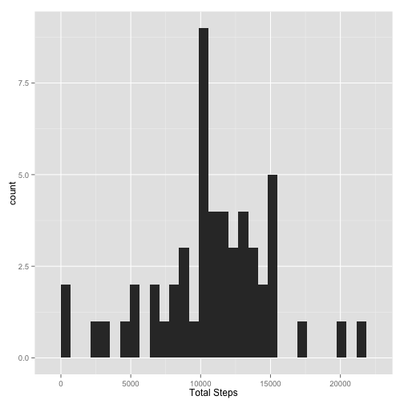
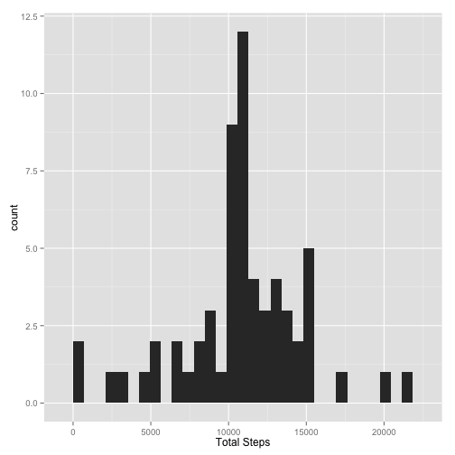
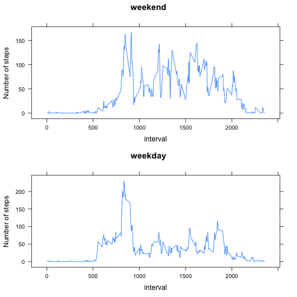

# Reproducible Research: Peer Assessment 1


## Loading and preprocessing the data


```r
library(ggplot2)
csv=read.csv("activity.csv", na.strings=c("NA"))
csv$date<-as.Date(csv$date, format="%Y-%m-%d")
```

## What is mean total number of steps taken per day?


```r
sumByDate<-aggregate(csv$steps,by=list(csv$date),sum)
sumByDateNoNA<-na.omit(sumByDate)
names(sumByDateNoNA)<-c("date","steps")
qplot(sumByDateNoNA$steps, data=sumByDateNoNA, xlab="Total Steps")
```

```
## stat_bin: binwidth defaulted to range/30. Use 'binwidth = x' to adjust this.
```

 

```r
themean<-mean(sumByDateNoNA$steps)
themedian<-median(sumByDateNoNA$steps)
```

The mean is 1.0766 &times; 10<sup>4</sup>

The median is 10765

## What is the average daily activity pattern?


```r
avgStepsPerInterval<-aggregate(steps~interval,data=csv,FUN="mean")
qplot(x=interval, y=steps, geom="line", data=avgStepsPerInterval)
```

 

```r
max<-avgStepsPerInterval[avgStepsPerInterval$steps==max(avgStepsPerInterval$steps),]
```
The Interval containing the maximum number of steps is 835

## Imputing missing values
### I will replace the mean for that 5-minute interval for the NAs


```r
totalNumberOfMissingRows<-nrow(csv)-nrow(csv[complete.cases(csv),])
replaced<-csv
for (i in 1:nrow(replaced)) {
        if (is.na(replaced$steps[i])) {
                replaced$steps[i]<-avgStepsPerInterval$steps[avgStepsPerInterval$interval==replaced$interval[i]]
        }
}


replacedDataSumByDate<-aggregate(replaced$steps,by=list(replaced$date),sum)
names(replacedDataSumByDate)<-c("date","steps")

qplot(replacedDataSumByDate$steps, data=replacedDataSumByDate, xlab="Total Steps")
```

```
## stat_bin: binwidth defaulted to range/30. Use 'binwidth = x' to adjust this.
```

 

```r
replacedMean<-mean(replacedDataSumByDate$steps)
replacedMedian<-median(replacedDataSumByDate$steps)
```

The new mean is 1.0766 &times; 10<sup>4</sup>

The new median is 1.0766 &times; 10<sup>4</sup>

Imputing missing data did not change mean but changed median. Looking at the previous plot it looks like it didnt make much difference

## Are there differences in activity patterns between weekdays and weekends?


```r
install.packages("gridExtra", repos="http://cran.rstudio.com/")
```

```
## 
## The downloaded binary packages are in
## 	/var/folders/tf/m2dwrfvs1zn5jvr31dxrjyr40000gn/T//RtmpqihEJS/downloaded_packages
```

```r
library(lattice)
library(gridExtra)
```

```
## Loading required package: grid
```

```r
# Introduce factor weekday or weekend
replaced$type<-factor(ifelse((weekdays(replaced$date)=="Saturday" | weekdays(replaced$date)=="Sunday"), "weekend", "weekday"))

replacedWE<-subset(replaced, type=="weekend")
replacedWD<-subset(replaced, type=="weekday")

replacedAvgWD<-aggregate(steps~interval,replacedWD,mean)
replacedAvgWE<-aggregate(steps~interval,replacedWE,mean)

p1<-xyplot(steps~interval, data=replacedAvgWE, type="l",main="weekend", ylab="Number of steps")
p2<-xyplot(steps~interval, data=replacedAvgWD, type="l",main="weekday", ylab="Number of steps")


grid.arrange(p1,p2,ncol=1)
```

 
